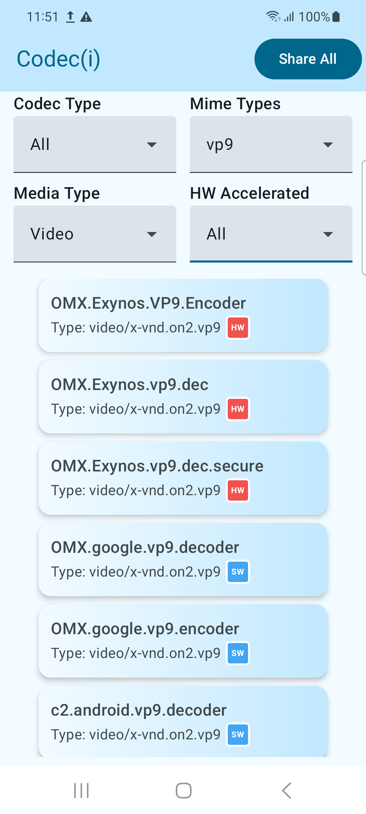
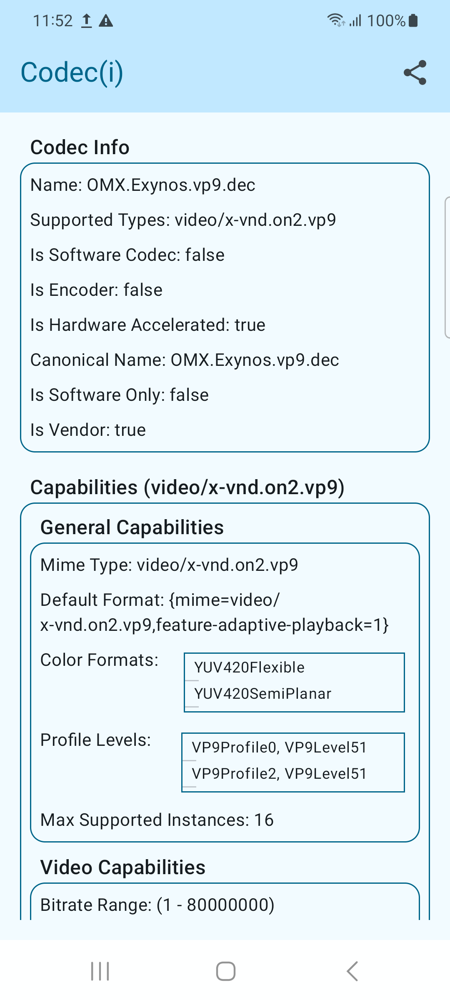
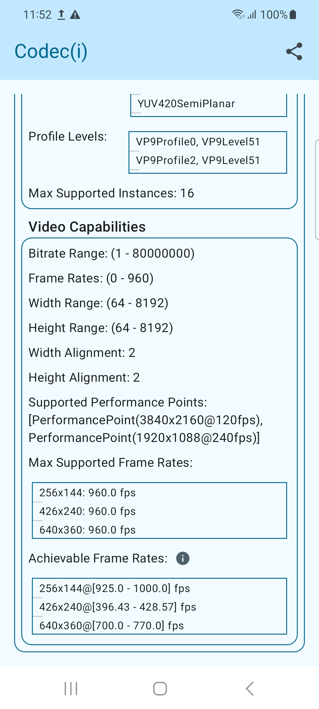
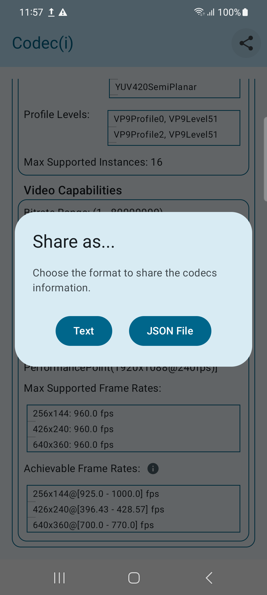

# Codecℹ️

A simple app and library for fetching and sharing Android devices codecs data.

## TODOs
- [ ] Add support for TVs
- [ ] Add deserialization to the library 
- [ ] Allow the app to receive shared json data and open the codec details screen
- [ ] Publish the library to Maven Central

## Screenshots

  
  
  
  

## 📜 License

This repository is a monorepo containing two separate projects, each with its own license. Please be sure to use the code under the correct license.

* **The Codec(i) Library (`/lib`)** is licensed under the **GNU Lesser General Public License v3.0 (LGPL-3.0)**. This makes the library available for use in both open source and proprietary applications, provided the terms of the LGPL are followed. See the full license in the [`lib/COPYING.LESSER`](./lib/COPYING.LESSER) file.

* **The Codec(i) App (`/app`)** is licensed under the **GNU General Public License v3.0 (GPL-3.0)**. This app is intended as a free, open-source example. See the full license in the [`app/COPYING`](./app/COPYING) file.

